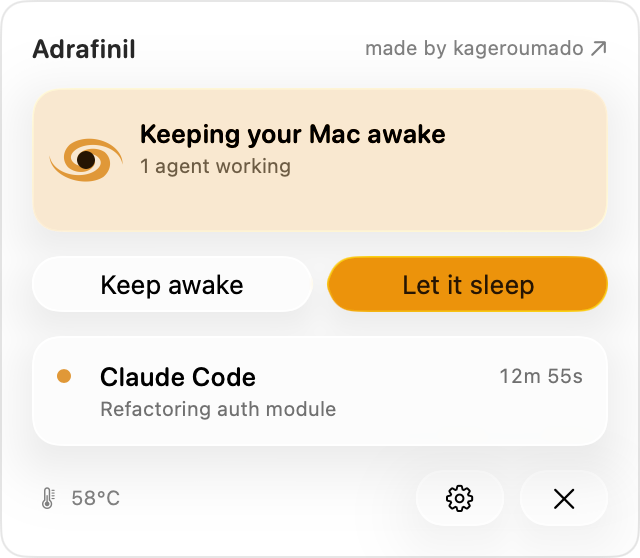
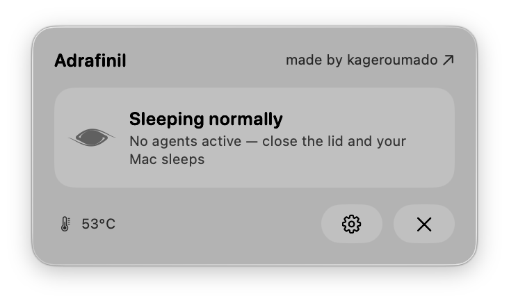

<div align="center">

[](https://kagerou.glass)


# adrafinil

**rx no. 006 ・ a·draf·i·nil /əˈdræfɪnɪl/ ・ a eugeroic for machines ♡**

[](https://kagerou.glass/adrafinil/)
[](https://x.com/kageroumado)
[](#requirements)

<table>
  <tr>
    <td align="center"><br><sub><b>awake</b> ・ an agent is working — or keep it awake yourself</sub></td>
    <td align="center"><br><sub><b>idle</b> ・ no agents, normal sleep — or keep it awake yourself</sub></td>
  </tr>
</table>

</div>

> **服用注意 ・ for machines that keep watch after you've gone to sleep.**
>
> It's 3 a.m. You're asleep. The agent isn't — it's still mid-thought in a session you started
> hours ago, and you've closed the lid over it like an eyelid that won't quite shut. `caffeinate`
> and Amphetamine are stimulants: they keep the machine wired *forever*, whether or not anyone's
> home. Adrafinil is the eugeroic. It does **nothing** until an agent acquires it, keeps your Mac
> awake through a closed lid only for as long as that work lives, and clears the moment the last
> session releases. It only ever wakes for the work — then you both sleep. ♡

---

Keep your Mac awake **only while AI agents are working**.

Adrafinil is a macOS menu bar app that prevents the system from sleeping — including clamshell
(lid-closed) sleep — **exclusively while an AI coding agent has an active session**. When no agent
is working, sleep behavior is untouched: close the lid and the Mac sleeps normally.

It's the opposite of always-on wake utilities like `caffeinate` or Amphetamine. Adrafinil only
intervenes when an agent (Claude Code, Codex, Cursor, …) is mid-task, and gets out of the way the
moment that work finishes.

**Three ways it stays awake:**

- **Automatically** — agent hooks tell Adrafinil when a turn starts and ends, so it holds sleep only while an agent is actually working. (Optional process-sniffing can also spot a running agent that has no hooks installed.)
- **Agent-driven** — an agent can deliberately keep the Mac awake *past its reply* for a long build or deploy, via the bundled MCP tool or the `adrafinil hold` CLI.
- **Manually** — a menu-bar **Keep awake** button places a time-boxed hold yourself, even with **no agents running**; **Let it sleep** clears everything.

> ⚠️ **Privileged sleep control.** Overriding clamshell sleep requires root. Adrafinil isolates
> that in a tiny, audited helper that only exposes `setSleepBlocked(Bool)` — all policy lives in an
> unprivileged daemon. It holds a standard `IOPMAssertion` for idle sleep and uses
> `pmset disablesleep` for clamshell (lid-closed) sleep, after verifying on-device that the cleaner
> private `IOPMrootDomain` paths don't keep a displayless lid-closed Mac awake. See
> [Docs/ARCHITECTURE.md](Docs/ARCHITECTURE.md) §2.

## Features

- **Agent-aware, not always-on.** Sleep is blocked only while ≥1 agent session holds an assertion. Zero sessions → normal sleep, including lid-close.
- **Hook integration for 9 agents.** One-click installer wires Adrafinil into the hook systems of Claude Code, Codex, Cursor, Gemini CLI, Aider, Hermes, OpenCode, Cline, and Pi.
- **Sub-50ms CLI.** `adrafinil acquire` / `release` are called from agent hooks and round-trip to the daemon in under 50ms, so they never stall an agent's workflow.
- **Reference-counted assertions.** Overlapping sessions stack cleanly; sleep unblocks only when the last one releases.
- **Thermal cutout.** If skin/CPU temperature crosses threshold while the lid is closed, all assertions are force-released so a bag-bound Mac can't cook itself.
- **Idle release.** Assertions whose owning process has died or gone CPU-idle for N minutes are dropped automatically.
- **Process sniffing (optional).** The daemon can auto-acquire when it sees a known agent binary running, even without hooks installed.
- **Manual keep-awake (no agent needed).** A menu-bar **Keep awake** button starts a time-boxed hold on demand — for a long download, a local job, anything off-agent — then **Let it sleep** releases it.
- **Lid-close audio + lid-open summary.** A chime confirms an assertion is held when you close the lid (the screen is off, so no notification); reopening shows what ran while you were away, peak temperature, and whether the thermal cutout fired.
- **Clean uninstall.** Removes every hook entry it added across all agent configs.

## Requirements

- **macOS Tahoe 26.4.** That's what I build and test on; it likely runs on earlier 26.x, but I haven't tested it there.
- **Xcode 26+** to build, with Swift 6 strict concurrency enabled.
- Admin rights for the standard install (the privileged helper installs via `SMAppService`). A non-admin install path drops the CLI in `~/.local/bin` instead of `/usr/local/bin`.

## Download

**[Download Adrafinil](https://github.com/kageroumado/adrafinil/releases/latest)** — a signed, notarized disk image. Open it, drag **Adrafinil** to Applications, and launch. The first launch asks for admin rights once to register the privileged helper. Requires macOS 26.4 or later.

Prefer to build it yourself? See [Building](#building).

## Building

```sh
git clone https://github.com/kageroumado/adrafinil.git
cd adrafinil
open Adrafinil.xcodeproj
```

In Xcode, select the **Adrafinil** scheme and Run. You'll need to set a development team for code
signing — the daemon (LaunchAgent) and helper (LaunchDaemon) are embedded into the app bundle and
registered with the system when the app launches. (No Team ID is baked into the source; the XPC
caller check reads your *own* signing team at runtime, so a rebuild under any Developer ID
authorizes its own components without code changes.)

For a headless compile check without local signing identities:

```sh
xcodebuild -project Adrafinil.xcodeproj -scheme Adrafinil -configuration Debug \
  -destination 'generic/platform=macOS' \
  CODE_SIGNING_ALLOWED=NO CODE_SIGNING_REQUIRED=NO CODE_SIGN_IDENTITY='' build
```

The shared logic builds and tests standalone as a Swift package:

```sh
cd AdrafinilShared
swift test
```

## How it works

Agents don't talk to Adrafinil directly. Each agent's hook system calls the bundled CLI:

```sh
adrafinil acquire <session-key> --tool claude-code --reason "long build"   # when a turn starts
adrafinil release <session-key>                                            # when the agent goes idle
```

Holds are **activity-scoped**, not session-scoped: Claude Code acquires on `UserPromptSubmit` and
releases on `Stop`, so the Mac is only kept awake while the agent is actually working — an
open-but-idle session at the prompt lets it sleep normally.

The daemon refcounts by session key and asks the helper to block sleep while the count is non-zero.

An agent can also keep the Mac awake for a background task that outlives its reply (a long build or
deploy) with a time-boxed **hold** — either by calling `adrafinil hold` directly or, for MCP-capable
agents, through the bundled MCP tool that `adrafinil mcp` serves:

```sh
adrafinil hold --for 30m --reason "deploy"   # keep awake up to 30 min, then auto-release
adrafinil mcp                                 # speak the Model Context Protocol on stdio (for agents)
```

You don't need an agent at all: the menu bar's **Keep awake** button places the same kind of
time-boxed hold by hand — for a long download or any off-agent task — and **Let it sleep** releases
everything. So Adrafinil covers all three: it auto-detects agent activity through hooks, lets agents
drive it explicitly over MCP/CLI, and can be flipped on manually when you need it.

Other subcommands: `status`, `install-hooks`, `uninstall-hooks`, `daemon-status`, `version`.

### Add your own agent

Adrafinil ships integrations for the common agents, but the CLI works for **any** tool — the daemon
accepts an arbitrary `--tool` label from any same-user caller, so nothing needs to change to wire up
one Adrafinil has never heard of. Settings → **Agents** → *Add your own agent* generates the exact
snippets from a name you type; pick the shape that matches your agent:

- **It has hooks / events** — add `acquire` on start and `release` on stop, keyed on your agent's
  session id so each turn brackets cleanly:

  ```sh
  adrafinil acquire "$SESSION_ID" --tool my-agent   # on start / prompt submit
  adrafinil release "$SESSION_ID" --tool my-agent   # on stop / finish
  ```

- **It has no hooks** — wrap the command so the hold spans the whole run (keyed on the shell's `$$`),
  or drop a single timed hold for a background job:

  ```sh
  adrafinil acquire $$ --tool my-agent && my-agent "$@"; adrafinil release $$ --tool my-agent
  adrafinil hold --for 2h --pid $$ --reason "my-agent session"
  ```

Custom agents aren't auto-detected or process-watched, so pair every `acquire` with a reliable
`release` — the idle-release timeout and each hold's time limit are the safety net if one is missed.

## Architecture

Four products across three privilege tiers (full detail, including the Xcode project layout, in
[Docs/ARCHITECTURE.md](Docs/ARCHITECTURE.md)):

```
┌──────────────────────────────────────────────────────────────┐
│  Adrafinil.app   (menu bar app, user-facing)                 │
│  • Status item, settings, installer GUI, lid-open summary    │
└─────────────────────────────┬────────────────────────────────┘
                              │ XPC
                              ▼
┌──────────────────────────────────────────────────────────────┐
│  AdrafinilDaemon  (LaunchAgent, runs as user, always-on)     │
│  • Reference-counted assertion registry                      │
│  • Process watchers (kqueue NOTE_EXIT + periodic sweep)      │
│  • Thermal monitor (SMC)  • Lid-state monitor (IORegistry)   │
│  • Lid-close chime  • CLI socket at …/Adrafinil/cli.sock     │
└─────────────────────────────┬────────────────────────────────┘
                              │ XPC (privileged Mach service)
                              ▼
┌──────────────────────────────────────────────────────────────┐
│  AdrafinilHelper  (SMAppService LaunchDaemon, root)          │
│  • The ONLY component that touches sleep-blocking APIs       │
│  • setSleepBlocked(Bool) + read-only state/version           │
│  • Verifies caller's code-signing requirement                │
└──────────────────────────────────────────────────────────────┘

  adrafinil  (CLI, ships inside the .app, symlinked onto PATH)
  • acquire / release / hold / mcp / status / install-hooks / uninstall-hooks
  • Connects to the daemon socket; <50ms round-trip
```

- **`AdrafinilShared`** — a Swift package shared across every target: data models (`AgentKind`, `Assertion`), the IPC wire formats, `AssertionRegistry`, `CallerVerifier`, the hook-install specs, and the CLI argument parser. This is where the unit tests live.
- **Helper stays trivial to audit.** It holds no policy — ref counting, thermal, idle, and lid logic all live in the daemon. The privileged surface is a single mutating endpoint plus read-only introspection.
- **Daemon is the source of truth.** The app is a pure view layer; it can quit and relaunch freely without affecting held assertions.

## Quirks worth knowing

- **Public IOPM assertions don't beat clamshell sleep.** `IOPMAssertionCreateWithName` with the public types (and therefore `caffeinate`) will not keep a lid-closed Mac awake. Adrafinil's v1 uses `pmset disablesleep 1`, which is blunt (it also disables idle sleep) and *must* be cleared on shutdown or it leaks — the helper resets to `disablesleep 0` on respawn before re-applying state.
- **Daemon handlers run on arbitrary queues.** XPC and socket callbacks can arrive on any dispatch queue, so the assertion registry and shared state are synchronized accordingly. Tread carefully around concurrency when modifying the daemon.
- **The CLI is on a latency budget.** `acquire`/`release` are in the hot path of every agent session, hence static lookups (e.g. `AgentKind.allBinaryNames`) and a thin socket protocol instead of full XPC for the CLI ↔ daemon hop.

## License

[MIT](LICENSE). Do whatever you want, no warranty.

## Acknowledgements

Built by [@kageroumado](https://x.com/kageroumado), dispensed at [kagerou.glass](https://kagerou.glass).
The name is a nod to [adrafinil](https://en.wikipedia.org/wiki/Adrafinil) — a wakefulness-promoting
prodrug — because the app keeps your machine awake only when it actually has work to do.
